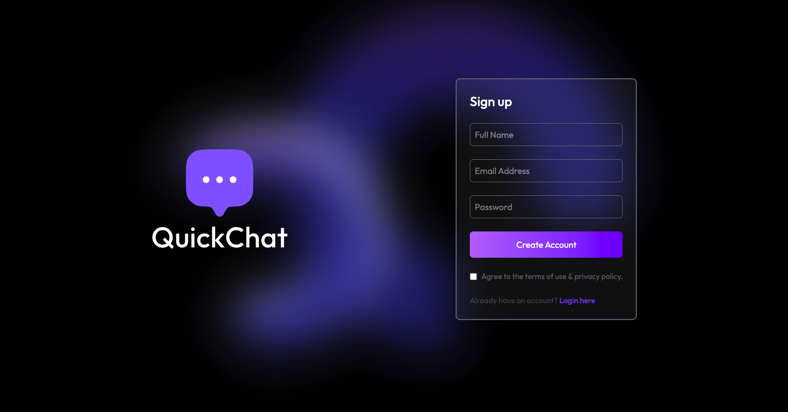

# 💬 QUICKCHAT — Real-Time Chat Application (MERN Stack + Socket.IO)



QUICKCHAT is a **full-stack MERN real-time chat application** that enables users to communicate instantly using Socket.IO.
It provides secure authentication, real-time messaging, and a modern responsive UI similar to popular chat platforms.
Users can register, log in, send and receive messages instantly without refreshing the page, and manage their profiles efficiently.

---

## 🧠 Features

- 🔐 User Authentication: Secure login & signup using JWT
- 💬 Real-Time Messaging: Instant message delivery with Socket.IO
- 🟢 Live Communication: No page reload required
- 👤 User Profiles: View and manage user profile information
- 📩 Message Persistence: Messages stored securely in MongoDB
- 💻 Responsive UI: Built using React and Tailwind CSS
- 📦 MongoDB Database: Store users and chat messages
- ⚡ Express.js Backend: REST APIs with middleware protection

---

## 💻 Tech Stack

| Technology                                                                                                       | Description                              |
| ---------------------------------------------------------------------------------------------------------------- | ---------------------------------------- |
|                 | Frontend library for building dynamic UI |
|   | Client-side routing                      |
|  | Responsive UI design                     |
|                 | Backend runtime                          |
|           | Backend web framework                    |
|                 | NoSQL database                           |
|              | ODM for MongoDB                          |
|         | Real-time communication                  |
|                       | HTTP client                              |
|                   | Authentication                           |
|                                                  | Password hashing                         |
|                                          | Media storage                            |
|                                                      | Cross-origin handling                    |
|                                                | Dev server auto-restart                  |

---

## 🚀 Application Capabilities

| Feature                    | Description                                                    |
| -------------------------- | -------------------------------------------------------------- |
| 🔐 **Authentication**      | Secure JWT-based user authentication                           |
| 💬 **Real-Time Chat**      | Instant messaging using Socket.IO                              |
| 📩 **Message Storage**     | Messages saved in MongoDB                                      |
| 👤 **User Management**     | Profile viewing and updates                                    |
| 💻 **Responsive Frontend** | Clean UI using **React + Tailwind CSS**                        |
| ⚡ **Express Backend**      | REST APIs with controllers & middleware                        |
| 🌐 **Env Configuration**   | Secure environment variables using `.env`                      |
| ☁️ **Deployment Ready**    | Ready for deployment on **Vercel**, **Render**, or **Railway** |

---

## 🗂️ Folder Structure

```
QuickChat-Full-Stack/
│
├── client/                     # React + Vite frontend
│   ├── src/
│   │   ├── assets/             # Images & icons
│   │   ├── components/         # UI components
│   │   ├── pages/              # App pages
│   │   ├── lib/                # Utility functions
│   │   ├── App.jsx
│   │   └── main.jsx
│   ├── package.json
│   └── vite.config.js
│
├── server/                     # Node.js + Express backend
│   ├── controllers/            # Business logic
│   ├── models/                 # MongoDB models
│   ├── routes/                 # API routes
│   ├── middleware/             # Auth middleware
│   ├── lib/                    # DB & helper configs
│   └── server.js               # Main server file
│
└── README.md
```

## 🏁 Getting Started

Follow these steps to run the project locally:

1. **Clone the repository**

```

git clone https://github.com/singhayush007/QUICK_CHAT.git
```

2. **Navigate to the project folder:**

```
cd QuickChat
```

3. **Install dependencies:**

```
npm install
```

4. **Create a .env.local file in the root and add your environment variables:**

```
PORT = ""
JWT_SECRET=""

# MongoDB URI
MONGODB_URI=your_mongodb_connection_uri

# Cloudinary Setup ( required )
CLOUDINARY_NAME = "your_cloud_name"
CLOUDINARY_API_KEY = "your_cloudinary_api_key"
CLOUDINARY_SECRET_KEY = "your_cloudinary_secret_key"
```

5. **Run the development server and client:**

```
cd client : npm run dev
cd server : npm run server
```

6. **Open the app in your browser:**

```
http://localhost:5173
```

## 💻 Deployment

You can deploy this app using Vercel, Docker, or any Node.js hosting platform.

## 📄 License

This project is licensed under the MIT License — feel free to use and modify it as per your needs.
